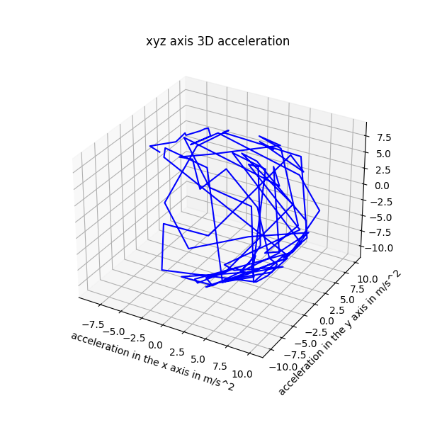
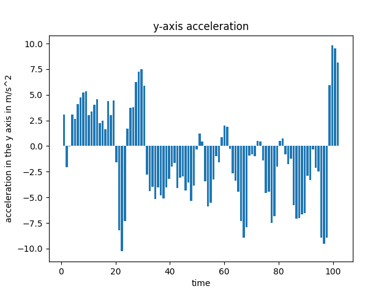
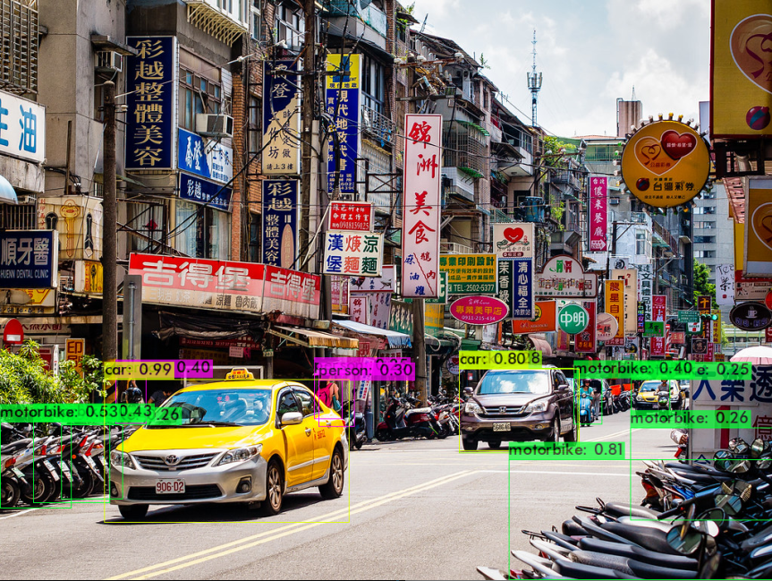
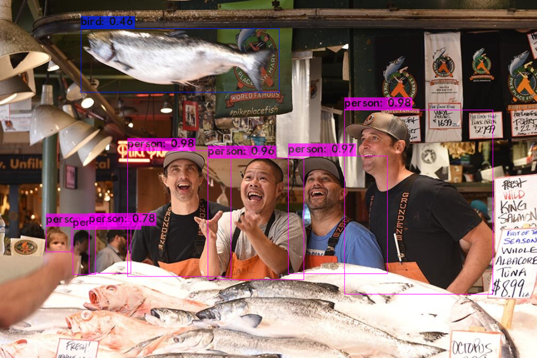

# Data Visualization Labs with Edge Device Data

## Overview

This repository contains a series of labs focused on data visualization using data collected by edge devices. These labs cover sensor data analysis, image classification, and advanced feature extraction techniques for imagery.

## 🔬 Lab Descriptions

**🌡️ Lab 3: Sensor Data Collection and Visualization**

Collected temperature and acceleration data using edge device sensors.

Processed and visualized time-series data.

**3D acceleration visual**

**Acceleration visual**

**🖼️ Lab 4: Image Classification**

Applied machine learning techniques to classify images.

Trained and evaluated models using labeled datasets collected from edge devices.

**📷 Lab 5: Imagery EXIF Information Extraction & Feature Visualization**

Extracted metadata from images, including GPS, camera settings, and timestamps.

Visualized key image attributes to understand spatial and temporal distributions.

**🔍 Lab 6: Object Detection with VGG16**

Implemented object detection using the pre-trained VGG16 deep learning model.

Processed and visualized object detection results on edge-collected imagery.

**Object Detection**

🏅 Acknowledgments

Special thanks to Dr. Dharmendra Saraswat and Dr. Aanis Ahmad for their contributions and guidance.
